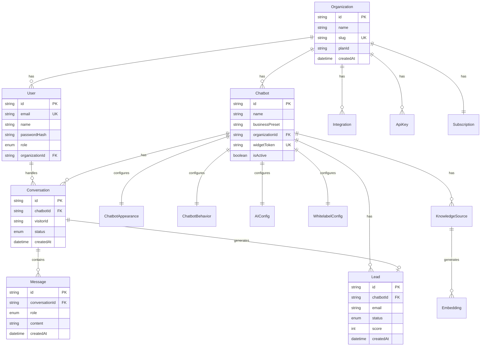

# Entity Relationship Diagram

```mermaid
erDiagram
    Organization ||--o{ User : has
    Organization ||--o{ Chatbot : has
    Organization ||--o{ Integration : has
    Organization ||--o{ ApiKey : has
    Organization ||--|| Subscription : has

    User ||--o{ Conversation : handles

    Chatbot ||--|| ChatbotAppearance : configures
    Chatbot ||--|| ChatbotBehavior : configures
    Chatbot ||--|| AIConfig : configures
    Chatbot ||--|| WhitelabelConfig : configures
    Chatbot ||--o{ KnowledgeSource : has
    Chatbot ||--o{ Conversation : has
    Chatbot ||--o{ Lead : has

    Conversation ||--o{ Message : contains
    Conversation ||--o| Lead : generates

    KnowledgeSource ||--o{ Embedding : generates

    Organization {
        string id PK
        string name
        string slug UK
        string planId
        datetime createdAt
    }

    User {
        string id PK
        string email UK
        string name
        string passwordHash
        enum role
        string organizationId FK
    }

    Chatbot {
        string id PK
        string name
        string businessPreset
        string organizationId FK
        string widgetToken UK
        boolean isActive
    }

    Conversation {
        string id PK
        string chatbotId FK
        string visitorId
        enum status
        datetime createdAt
    }

    Message {
        string id PK
        string conversationId FK
        enum role
        string content
        datetime createdAt
    }

    Lead {
        string id PK
        string chatbotId FK
        string email
        enum status
        int score
        datetime createdAt
    }
```

## Vector Search
Embeddings stored using pgvector extension for semantic search capabilities.
