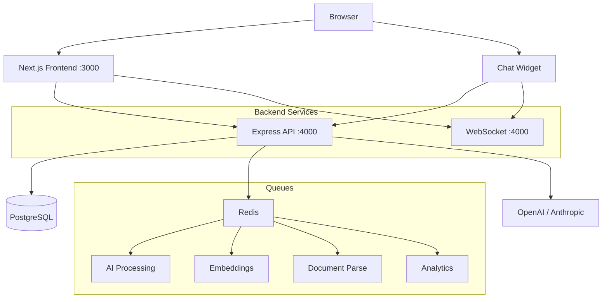
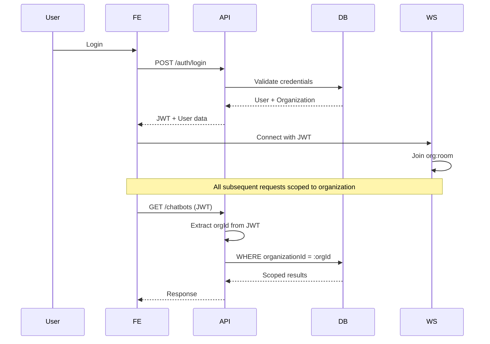
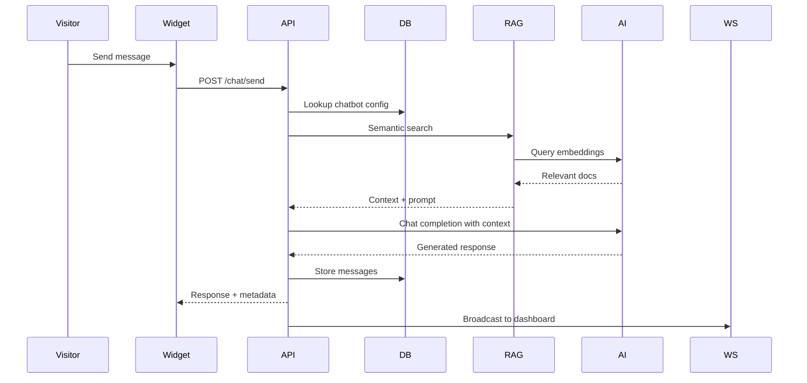
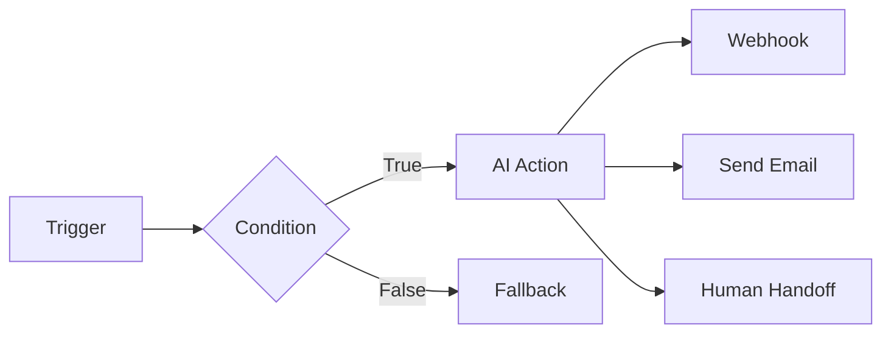

# Architecture

## System Diagram



## Multi-Tenant Flow



## AI Chat Flow with RAG



## WebSocket Events

| Event | Direction | Description |
|-------|-----------|-------------|
| `conversation:new` | Server → Client | New conversation created |
| `conversation:message` | Server → Client | New message in conversation |
| `conversation:status` | Server → Client | Status changed |
| `lead:new` | Server → Client | New lead captured |
| `analytics:update` | Server → Client | Real-time metrics update |

## Workflow Engine



## Data Flow

```
Widget / Web App
    ↓ HTTP / WebSocket
API Gateway (Express + Socket.IO)
    ↓
Auth → Rate Limit → Validation → RBAC
    ↓
Service Layer (AI, RAG, Workflow, Analytics)
    ↓
Repository Layer (Prisma)
    ↓
PostgreSQL + Redis
```
